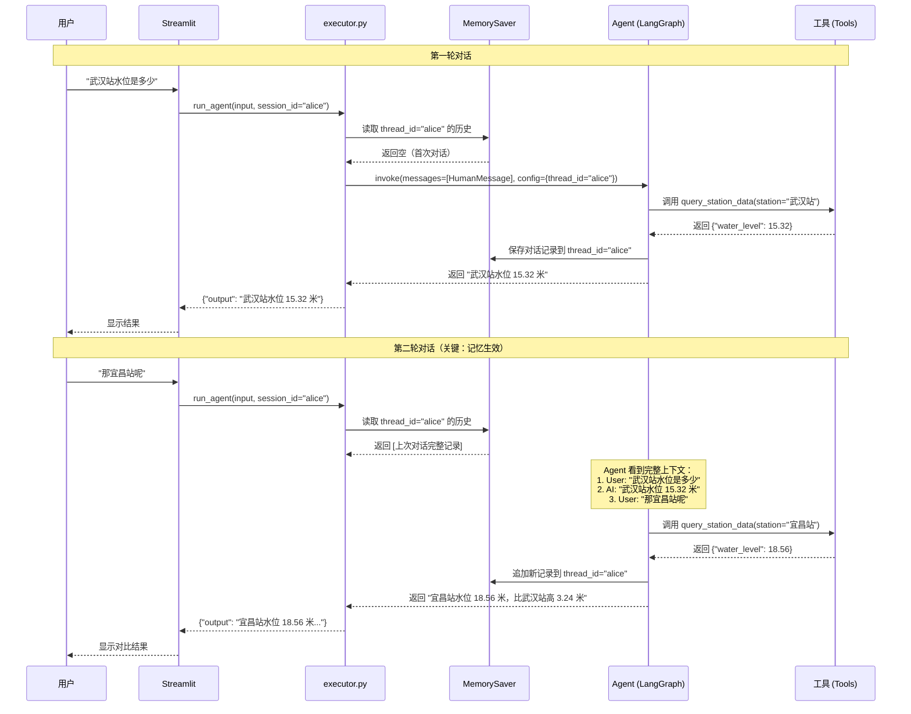

# Agent 上下文记忆机制

## 核心原理

使用 **LangGraph MemorySaver** 实现跨轮次对话记忆，通过 `thread_id` 隔离不同用户会话。

## 工作流程

```
用户 A (thread_id: "user_a")
  轮次 1："武汉站水位是多少" → Agent 查询 → 回答
  轮次 2："那宜昌站呢"       → Agent **记住武汉站上下文** → 对比回答

用户 B (thread_id: "user_b") 
  轮次 1："查询定曲河数据"   → 独立上下文，不受用户 A 影响
```

## 具体实现

### 1. 创建 Agent 时绑定 MemorySaver

```python
# agent/executor.py Line 148-162

_memory = MemorySaver()   # 全局单例，进程内持久化
_agent_graph = None

def _get_agent():
    global _agent_graph
    if _agent_graph is None:
        llm = build_llm()
        _agent_graph = create_react_agent(
            model=llm,
            tools=ALL_AGENT_TOOLS,
            prompt=SYSTEM_PROMPT,
            checkpointer=_memory,  # ← 关键：绑定记忆存储
        )
    return _agent_graph
```

### 2. 每次调用传入 thread_id

```python
# agent/executor.py Line 270-272

config = {"configurable": {"thread_id": thread_id}}
result = agent.invoke(
    {"messages": [{"role": "user", "content": user_input}]},
    config,  # ← thread_id 决定使用哪段记忆
)
```

### 3. MemorySaver 自动管理历史

- **首次请求**：`_memory` 为空，Agent 从头开始
- **后续请求**：`_memory` 读取该 `thread_id` 的所有历史消息（用户输入 + AI 回复 + 工具调用结果）
- **自动追加**：每次执行完，新的消息自动保存到 `_memory[thread_id]`

## 时序图



## 关键代码位置

| 功能 | 文件 | 行号 |
|------|------|------|
| MemorySaver 初始化 | `agent/executor.py` | 148 |
| Agent 绑定 checkpointer | `agent/executor.py` | 160 |
| thread_id 传入 | `agent/executor.py` | 271 |
| Streamlit session_state | `streamlit_demo.py` | 185 |

## 存储方式

- **当前**：`MemorySaver()` 进程内存储（重启服务后丢失）
- **生产环境**：可替换为 `SqliteSaver()` 或 `PostgresSaver()` 持久化到数据库

## 会话隔离

- 不同 `session_id` 的用户**完全隔离**，互不影响
- Streamlit 通过 `st.session_state` 自动生成唯一 session_id
- 同一用户刷新页面 → 新 session_id → 历史清空
