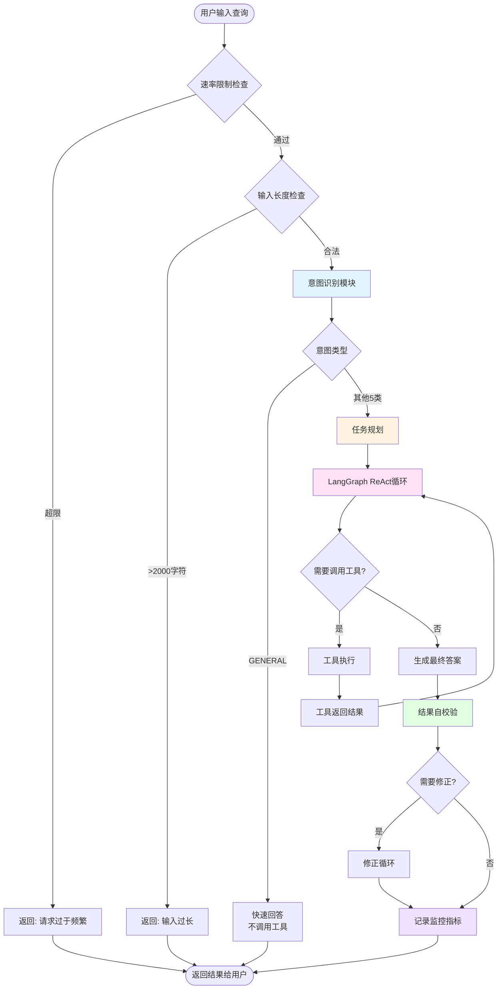
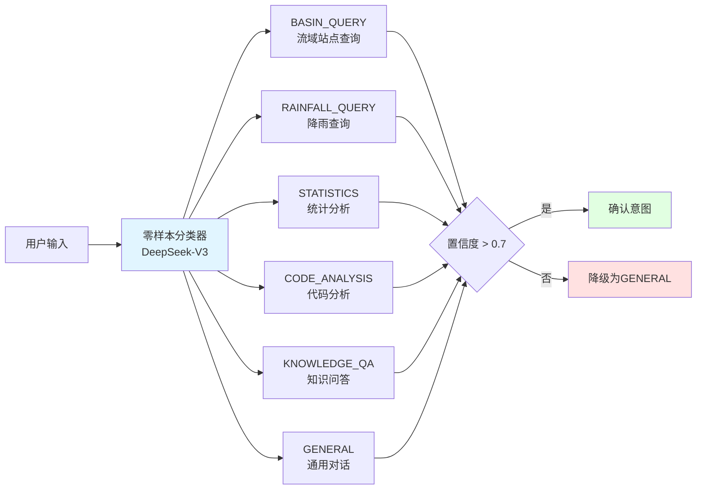
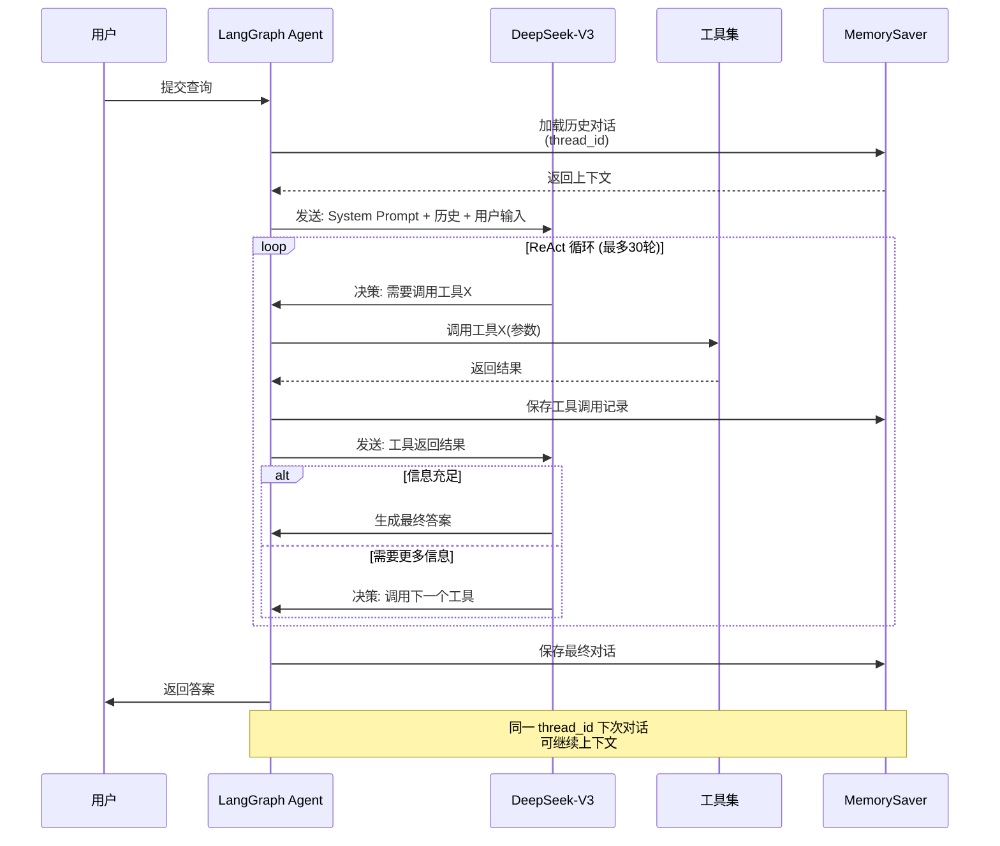
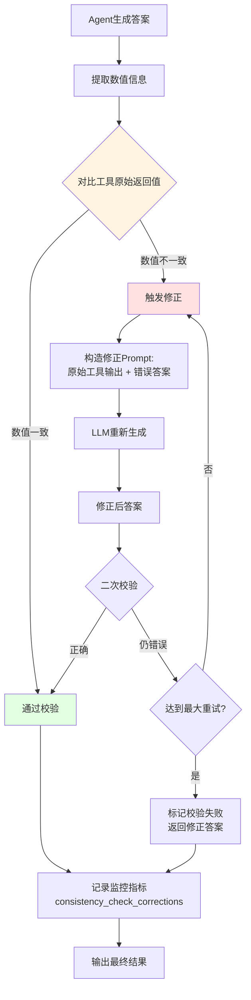

# 流域水文智能 Agent - 业务流程图

## 1. 系统整体架构流程



## 2. 意图识别流程



## 3. 工具调用流程（ReAct 循环）



## 4. 数据查询工具分类

```mermaid
graph TB
    Tools[工具集] --> DB[数据库查询工具]
    Tools --> CSV[CSV文件工具]
    Tools --> Compute[计算分析工具]
    Tools --> RAG[知识库工具]
    
    DB --> DB1[query_station_list<br/>站点列表查询]
    DB --> DB2[query_dqh_events<br/>定曲河事件查询]
    DB --> DB3[query_dqh_rainfall<br/>定曲河降雨数据]
    DB --> DB4[query_dqh_statistics<br/>定曲河统计]
    DB --> DB5[query_btpzh_rainfall<br/>巴塘-攀枝花降雨]
    DB --> DB6[query_btpzh_statistics<br/>巴塘-攀枝花统计]
    
    CSV --> CSV1[query_guangdong_events<br/>广东流域事件列表]
    CSV --> CSV2[query_guangdong_rainfall<br/>广东流域降雨数据]
    CSV --> CSV3[query_guangdong_statistics<br/>广东流域统计]
    
    Compute --> Compute1[execute_python_analysis<br/>隔离沙盒执行代码]
    Compute --> Compute2[calculate_correlation<br/>相关性计算]
    
    RAG --> RAG1[search_knowledge_base<br/>BGE + BM25混合检索]
    RAG --> RAG2[query_basin_topology<br/>流域拓扑查询]
    
    style DB fill:#e1f5ff
    style CSV fill:#fff4e1
    style Compute fill:#ffe1f5
    style RAG fill:#e1ffe1
```



## 5. 结果自校验流程



## 6. 监控指标收集流程

```mermaid
graph LR
    Executor[executor.py] -->|record_query_start| Metrics1[agent_query_total++]
    Executor -->|record_tool_call| Metrics2[agent_tool_call_total++]
    Executor -->|record_query_end| Metrics3[agent_query_duration<br/>记录耗时]
    Executor -->|record_consistency_check| Metrics4[consistency_check_corrections]
    
    Metrics1 --> Registry[Prometheus REGISTRY]
    Metrics2 --> Registry
    Metrics3 --> Registry
    Metrics4 --> Registry
    
    Registry --> Writer[shared_metrics.py<br/>后台线程写入器<br/>每2秒]
    Writer --> File[data/metrics/<br/>current_metrics.txt]
    
    File --> Exporter[exporter.py<br/>HTTP服务器:8000]
    Exporter --> Endpoint[/metrics 端点]
    
    Endpoint --> Dashboard[monitoring_dashboard.py<br/>Streamlit可视化]
    
    style Registry fill:#e1f5ff
    style Writer fill:#fff4e1
    style Exporter fill:#ffe1f5
    style Dashboard fill:#e1ffe1
```

## 7. Streamlit 前端交互流程

```mermaid
graph TB
    User([用户访问<br/>localhost:8501]) --> Tabs{选择Tab}
    
    Tabs --> Tab1[🌏 流域总览<br/>地图展示]
    Tabs --> Tab2[💬 智能对话<br/>ReAct Agent]
    Tabs --> Tab3[📊 流域历史事件<br/>事件查询]
    Tabs --> Tab4[📈 BtPzh时序<br/>多站对比]
    Tabs --> Tab5[🧪 代码沙盒<br/>Python执行]
    Tabs --> Tab6[📊 系统监控<br/>指标可视化]
    
    Tab1 --> Map[Leaflet地图<br/>+ GeoJSON流域边界<br/>+ 站点标记]
    
    Tab2 --> ChatInput[用户输入]
    ChatInput --> SessionID[生成session_id]
    SessionID --> RunAgent[调用run_agent()]
    RunAgent --> Memory[MemorySaver<br/>跨轮次记忆]
    Memory --> Response[显示Agent回答]
    Response --> Feedback[👍👎 反馈收集]
    
    Tab3 --> QueryForm[事件选择表单]
    QueryForm --> ToolCall[直接调用query工具]
    ToolCall --> Chart1[Plotly过程线图<br/>+ 统计柱状图]
    
    Tab4 --> MultiSelect[多站点选择器]
    MultiSelect --> TimeRange[时间范围选择]
    TimeRange --> Chart2[多条折线对比图]
    
    Tab5 --> CodeEditor[代码编辑器]
    CodeEditor --> Sandbox[execute_python_analysis<br/>隔离进程执行]
    Sandbox --> Output[显示结果 + 图片]
    
    Tab6 --> MetricsAPI[读取/metrics端点]
    MetricsAPI --> Charts[Plotly时序图<br/>+ 饼图统计]
    
    style Tab2 fill:#e1f5ff
    style Memory fill:#fff4e1
    style Sandbox fill:#ffe1f5
    style MetricsAPI fill:#e1ffe1
```

## 8. 广东流域CSV数据查询流程

```mermaid
graph TB
    Query[用户查询广东流域] --> IntentGD[识别流域:<br/>bjh/tj/js/hzk/bpz]
    IntentGD --> Tool{工具选择}
    
    Tool --> ListEvents[query_guangdong_events<br/>列出事件编码]
    Tool --> GetData[query_guangdong_rainfall<br/>读取CSV时序数据]
    Tool --> GetStats[query_guangdong_statistics<br/>计算统计指标]
    
    ListEvents --> Dir1[扫描Flood目录<br/>H:\Biye\Data\Model\{basin}\Flood\]
    Dir1 --> FileList[返回YYYYMMDDHH.csv列表]
    
    GetData --> ReadCSV[读取指定事件CSV]
    ReadCSV --> ParseCols[解析列:<br/>ID/站点雨量/Q/Z]
    ParseCols --> Return1[返回Markdown表格]
    
    GetStats --> CalcSum[计算累计雨量]
    GetStats --> CalcMax[计算最大时段雨量]
    GetStats --> CalcFlow[提取最大流量<br/>from Q列]
    CalcSum --> Return2[返回统计表]
    CalcMax --> Return2
    CalcFlow --> Return2
    
    FileList --> Agent[返回给Agent]
    Return1 --> Agent
    Return2 --> Agent
    
    style IntentGD fill:#fff4e1
    style ReadCSV fill:#e1f5ff
    style CalcFlow fill:#ffe1f5
```

---

## 关键技术特性

### 1. 对话记忆持久化
- **MemorySaver**：LangGraph 内置 checkpointer
- **thread_id**：每个用户会话独立 ID（`streamlit_{uuid}`）
- **消息链完整性**：AIMessage.tool_calls ↔ ToolMessage 一一对应

### 2. 混合检索（RAG）
- **BGE-small-zh**：向量化嵌入
- **BM25**：关键词匹配
- **RRF**：倒数排名融合（Reciprocal Rank Fusion）

### 3. 代码沙盒安全
- **隔离进程**：`subprocess.run()` 独立运行
- **白名单导入**：仅允许 pandas/numpy/matplotlib/sqlite3
- **超时控制**：30秒强制终止
- **环境变量**：预设数据库路径

### 4. 监控指标跨进程共享
- **Prometheus Registry**：metrics_collector 记录
- **后台写入线程**：每2秒同步到文件
- **HTTP Exporter**：独立进程暴露/metrics端点
- **Streamlit 可视化**：实时读取并绘图
