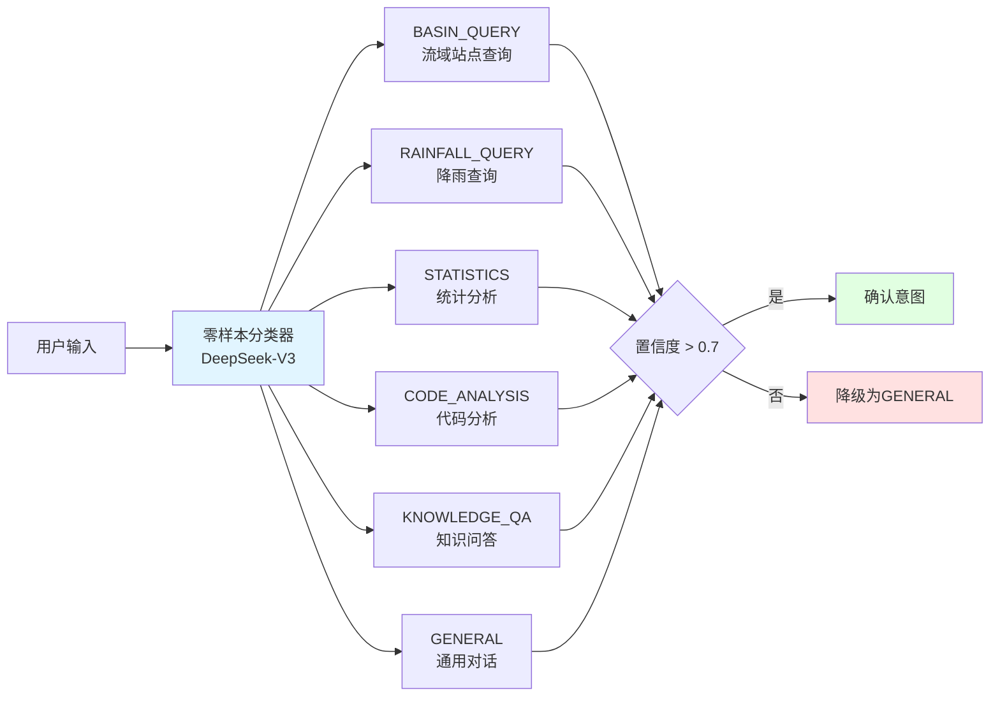
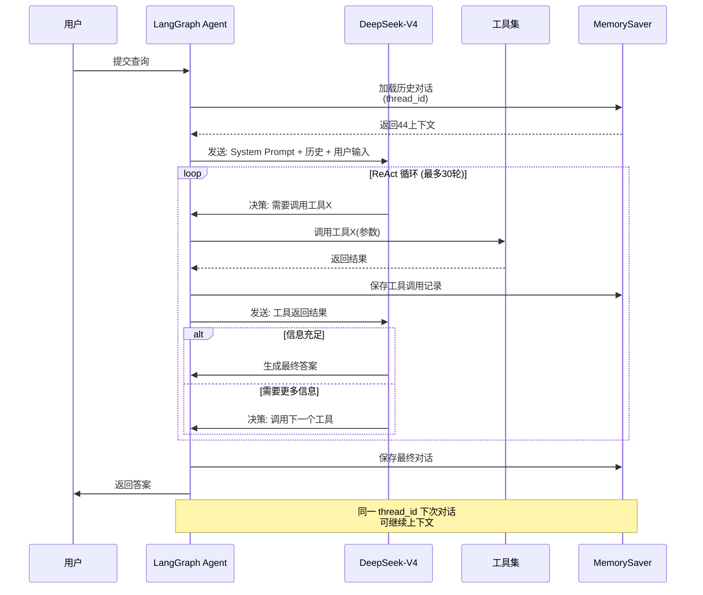
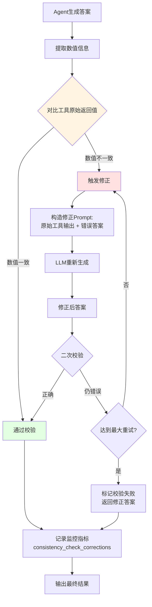

# 流域水文智能 Agent - 业务流程图

## 1. 系统整体架构流程

```mermaid
graph TB
    Start([用户输入查询]) --> RateLimit{速率限制检查}
    RateLimit -->|超限| Error1[返回: 请求过于频繁]
    RateLimit -->|通过| InputCheck{输入长度检查}
    InputCheck -->|>2000字符| Error2[返回: 输入过长]
    InputCheck -->|合法| Intent[意图识别模块]
    
    Intent --> IntentType{意图类型}
    IntentType -->|GENERAL| FastAnswer[快速回答<br/>不调用工具]
    IntentType -->|其他5类| Planning[任务规划]
    
    Planning --> ReactLoop[LangGraph ReAct循环]
    ReactLoop --> ToolSelection{需要调用工具?}
    ToolSelection -->|是| ToolExec[工具执行]
    ToolSelection -->|否| FinalAnswer[生成最终答案]
    
    ToolExec --> ToolResult[工具返回结果]
    ToolResult --> ReactLoop
    
    FinalAnswer --> SelfCheck[结果自校验]
    SelfCheck --> Corrected{需要修正?}
    Corrected -->|是| CorrectionLoop[修正循环]
    Corrected -->|否| MetricsRecord[记录监控指标]
    
    CorrectionLoop --> MetricsRecord
    MetricsRecord --> Response([返回结果给用户])
    FastAnswer --> Response
    Error1 --> Response
    Error2 --> Response
    
    style Intent fill:#e1f5ff
    style Planning fill:#fff4e1
    style ReactLoop fill:#ffe1f5
    style SelfCheck fill:#e1ffe1
    style MetricsRecord fill:#f0e1ff
```

## 2. 意图识别流程

```mermaid
graph LR
    Input[用户输入] --> Classifier[零样本分类器<br/>DeepSeek-V3]
    Classifier --> Intent1[BASIN_QUERY<br/>流域站点查询]
    Classifier --> Intent2[RAINFALL_QUERY<br/>降雨查询]
    Classifier --> Intent3[STATISTICS<br/>统计分析]
    Classifier --> Intent4[CODE_ANALYSIS<br/>代码分析]
    Classifier --> Intent5[KNOWLEDGE_QA<br/>知识问答]
    Classifier --> Intent6[GENERAL<br/>通用对话]
    
    Intent1 --> Conf{置信度 > 0.7}
    Intent2 --> Conf
    Intent3 --> Conf
    Intent4 --> Conf
    Intent5 --> Conf
    Intent6 --> Conf
    
    Conf -->|是| Accept[确认意图]
    Conf -->|否| Fallback[降级为GENERAL]
    
    style Classifier fill:#e1f5ff
    style Accept fill:#e1ffe1
    style Fallback fill:#ffe1e1
```

## 3. 工具调用流程（ReAct 循环）

```mermaid
sequenceDiagram
    participant User as 用户
    participant Agent as LangGraph Agent
    participant LLM as DeepSeek-V4
    participant Tools as 工具集
    participant Memory as MemorySaver

    User->>Agent: 提交查询
    Agent->>Memory: 加载历史对话<br/>(thread_id)
    Memory-->>Agent: 返回44上下文
    
    Agent->>LLM: 发送: System Prompt + 历史 + 用户输入
    
    loop ReAct 循环 (最多30轮)
        LLM->>Agent: 决策: 需要调用工具X
        Agent->>Tools: 调用工具X(参数)
        Tools-->>Agent: 返回结果
        Agent->>Memory: 保存工具调用记录
        Agent->>LLM: 发送: 工具返回结果
        
        alt 信息充足
            LLM->>Agent: 生成最终答案
        else 需要更多信息
            LLM->>Agent: 决策: 调用下一个工具
        end
    end
    
    Agent->>Memory: 保存最终对话
    Agent->>User: 返回答案
    
    Note over Agent,Memory: 同一 thread_id 下次对话<br/>可继续上下文
```

## 

## 4. 结果自校验流程

```mermaid
graph TB
    Answer[Agent生成答案] --> Extract[提取数值信息]
    Extract --> Compare{对比工具原始返回值}
    
    Compare -->|数值一致| Pass[通过校验]
    Compare -->|数值不一致| Correct[触发修正]
    
    Correct --> CorrectionPrompt[构造修正Prompt:<br/>原始工具输出 + 错误答案]
    CorrectionPrompt --> LLM[LLM重新生成]
    LLM --> CorrectedAnswer[修正后答案]
    
    CorrectedAnswer --> Verify{二次校验}
    Verify -->|仍错误| MaxRetry{达到最大重试?}
    MaxRetry -->|否| Correct
    MaxRetry -->|是| ForcePass[标记校验失败<br/>返回修正答案]
    
    Verify -->|正确| Pass
    Pass --> MetricsLog[记录监控指标<br/>consistency_check_corrections]
    ForcePass --> MetricsLog
    
    MetricsLog --> FinalOutput[输出最终结果]
    
    style Compare fill:#fff4e1
    style Correct fill:#ffe1e1
    style Pass fill:#e1ffe1
```

